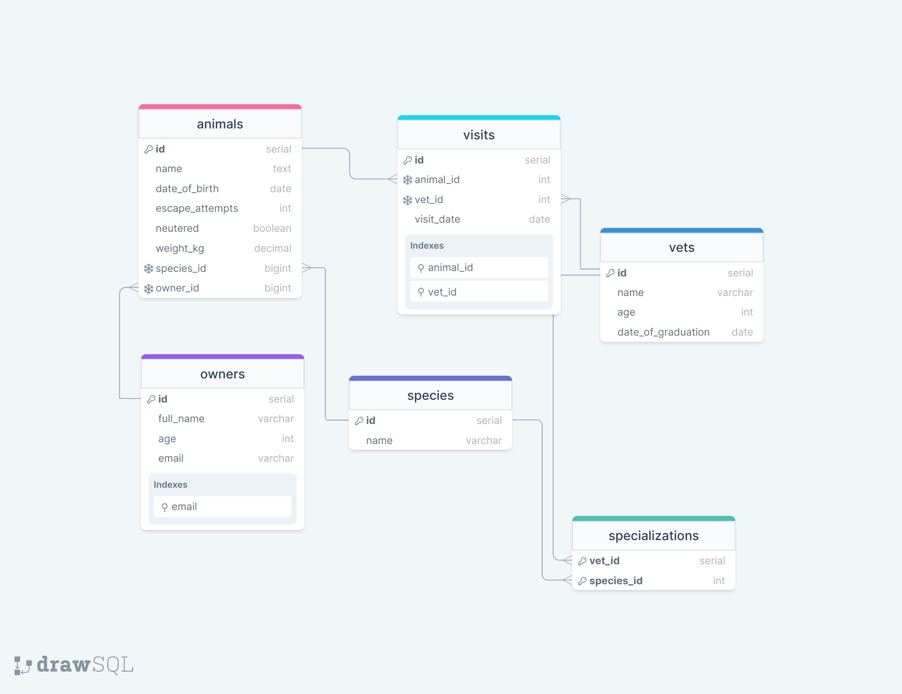

<a name="readme-top"></a>

<div align="center">
  
  <h3><b>Vet_Clinic README</b></h3>
</div>

<!-- TABLE OF CONTENTS -->
# 📗 Table of Contents

- [📖 About the Project](#about-project)
  - [🛠 Built With](#built-with)
    - [Tech Stack](#tech-stack)
    - [Key Features](#key-features)
  - [🚀 Live Demo](#live-demo)
- [💻 Getting Started](#getting-started)
  - [Setup](#setup)
  - [Prerequisites](#prerequisites)
  - [Install](#install)
  - [Usage](#usage)
  - [Run tests](#run-tests)
  - [Deployment](#triangular_flag_on_post-deployment)
- [👥 Authors](#authors)
- [🔭 Future Features](#future-features)
- [🤝 Contributing](#contributing)
- [⭐️ Show your support](#support)
- [🙏 Acknowledgements](#acknowledgements)
- [❓ FAQ](#faq)
- [📝 License](#license)

# 📖 Vet Clinic Database <a name="about-project"></a>

**Vet Clinic Database** is a database project for a veterinary clinic. It includes tables for animals, owners, clinic employees, and visits.

## 🛠 Built With <a name="built-with"></a>

### Tech Stack <a name="tech-stack"></a>

<details>
  <summary>Client</summary>
  <ul>
    <li><a href="https://reactjs.org/">React.js</a></li>
  </ul>
</details>

<details>
  <summary>Server</summary>
  <ul>
    <li><a href="https://expressjs.com/">Express.js</a></li>
  </ul>
</details>

<details>
<summary>Database</summary>
  <ul>
    <li><a href="https://www.postgresql.org/">PostgreSQL</a></li>
  </ul>
</details>

### Key Features <a name="key-features"></a>

- **N/A**

## 🚀 Live Demo <a name="live-demo"></a>

- **N/A**

## 💻 Getting Started <a name="getting-started"></a>


To get a local copy up and running, follow these steps.

### Prerequisites

In order to run this project you need:

- A web browser to view output e.g [Google Chrome](https://www.google.com/chrome/).
- An IDE e.g [Visual studio code](https://code.visualstudio.com/).

### Setup

Clone this repository to your desired folder or download the Zip folder:

```
https://github.com/fpsapc/vetClinic
```

- Navigate to the location of the folder in your machine:

**``you@your-Pc-name:~$ cd vetClinic``**

<!-- AUTHORS -->

## 👥 Author´s <a name="authors"></a>

👤 **Salman Ahmad Khan**

- GitHub: [@githubhandle](https://github.com/fpsapc)
- Twitter: [@twitterhandle](https://twitter.com/fpsapc)
- LinkedIn: [LinkedIn](https://linkedin.com/in/salman-ahmad1987 )


👤 **Daniel Falcon**

- GitHub: [@Danfall369](https://github.com/Danfall369)
- Twitter: [@Danfall369](https://twitter.com/Danfall369)
- Linkeid [@Danfall369](https://www.linkedin.com/in/danfall369/)

<p align="right">(<a href="#readme-top">back to top</a>)</p>

<!-- FUTURE FEATURES -->

## 🔭 Future Features <a name="future-features"></a>

- [ ] **[I will add more tables in this database]**

<p align="right">(<a href="#readme-top">back to top</a>)</p>

<!-- CONTRIBUTING -->

## 🤝 Contributing <a name="contributing"></a>

Contributions, issues, and feature requests are welcome!

Feel free to check the [issues page](../../issues/).

<p align="right">(<a href="#readme-top">back to top</a>)</p>

<!-- SUPPORT -->

## ⭐️ Show your support <a name="support"></a>

If you like this project give me a star ⭐️

<p align="right">(<a href="#readme-top">back to top</a>)</p>

<!-- ACKNOWLEDGEMENTS -->

## 🙏 Acknowledgments <a name="acknowledgements"></a>

Thanks to Microverse to provide information to make this project.

<p align="right">(<a href="#readme-top">back to top</a>)</p>

<!-- FAQ (optional) -->

## ❓ FAQ (OPTIONAL) <a name="faq"></a>

- **[How this list works]**

  - [You can only see schema.sql, data.sql, queries.sql files so far in this repo.]

<p align="right">(<a href="#readme-top">back to top</a>)</p>

<!-- LICENSE -->

## 📝 License <a name="license"></a>

This project is [MIT](./LICENSE) licensed.

<p align="right">(<a href="#readme-top">back to top</a>)</p>
